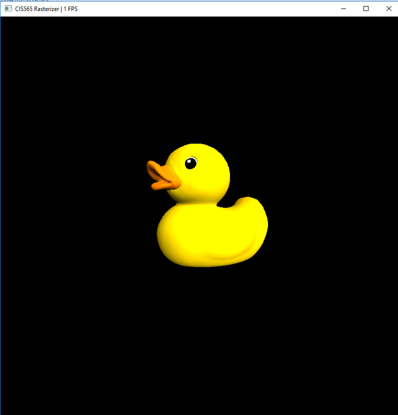
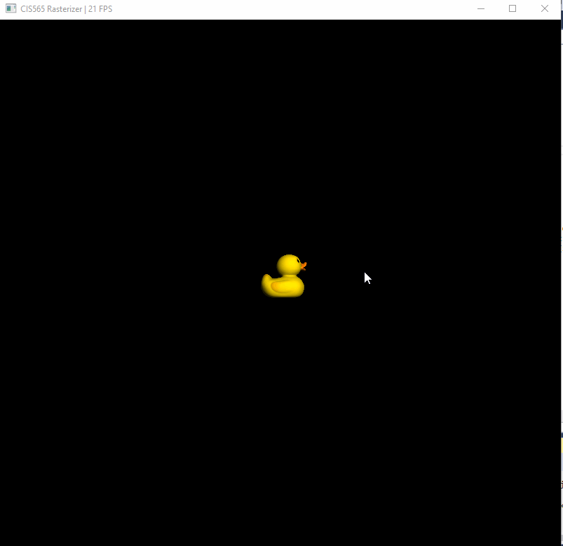
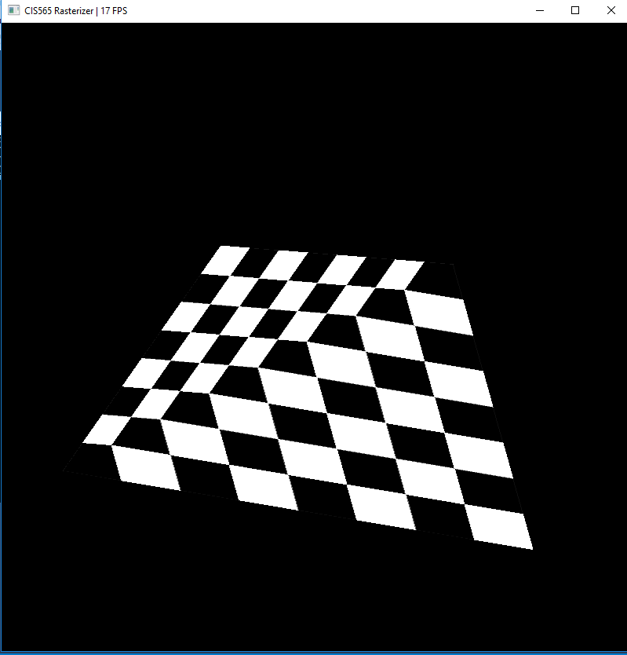
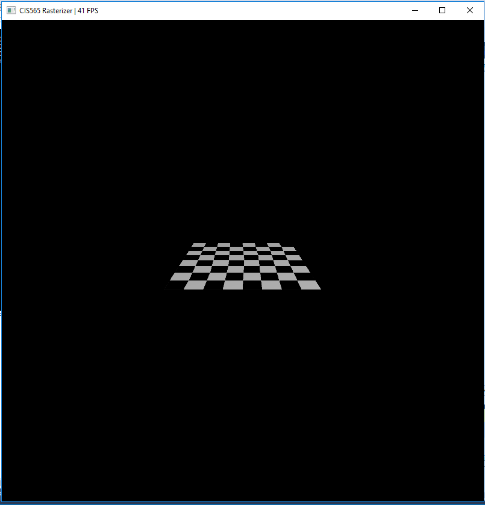

CUDA Rasterizer
===============

**University of Pennsylvania, CIS 565: GPU Programming and Architecture, Project 4**

* Alexander Perry
* Tested on: Windows 10, i5-2410M @ 2.30GHz 8GB, NVS 4200M (personal computer)

### Features
#### Shared Memory
I used shared memory to load primitives in the rasterization function. This avoids using global memory for the most common accesses as most of the computation in this function depends on the primitive.

#### Texture loading.
I implemented correct texture mapping for both proper color and UV coordinates based on perspective. See before and after:

This also includes bilinear filtering on the textures.

### Analysis
The largest optimization I made was to use multiple CUDA streams for rasterization. I launched a different kernel for each primitive to render with block size determined by the AABB of the primitive. This allows the GPU to be more efficient at scheduling the kernels as they can be scheduled in any order. I tested this by loading the duck object, not moving the camera and wating for the FPS to settle. With this optimization on, I get 22fps. With the optimization off I get 18fps. This is an improvement of 22%.

Another minor optimization I made was in the render function. In order to avoid computing lambertian reflection for every fragment, I allowed for early termination of fragments whose color was black. With the optimization off, the render function takes 10.24ms. With the optimaztion on, the render function takes only 5.6ms. This is a speed up of almost 50%. This was computed using the same setup as the previous test, which creates a sceme with a lot of background, which is the ideal case for the optimization.

### Credits

* [tinygltfloader](https://github.com/syoyo/tinygltfloader) by [@soyoyo](https://github.com/syoyo)
* [glTF Sample Models](https://github.com/KhronosGroup/glTF/blob/master/sampleModels/README.md)
